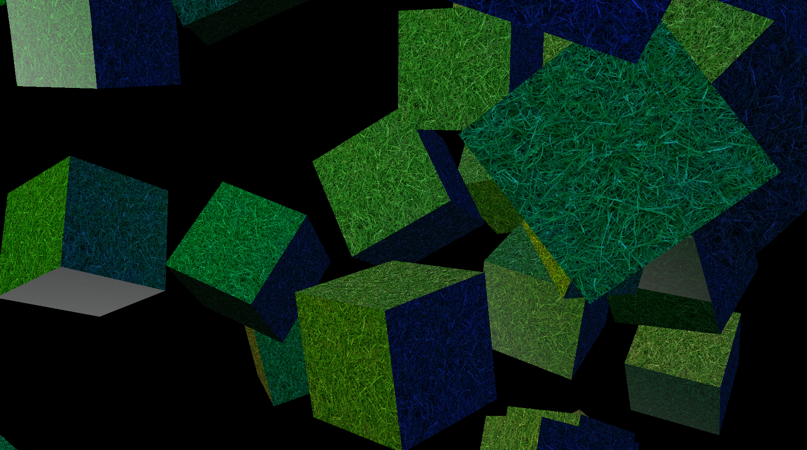

# GWindow_Sandbox
Sandbox for testing the Vulkan rendering system.

## Test Preview

### Ubuntu, Linux Mint, 
* Run setup.ubuntu.sh in terminal as root IN the GWindow_Sandbox folder for Mint and Ubuntu versions.

### VSCode
* c/c++ (microsoft)
* cmake language support
* cmake tools
* shader language support
Ctrl+Shift+P cmake: build cmake: debug

### Note
If you get "X Error of failed request: BadValue (integer parameter out of range for operation)" try restarting
Note debug output won't work unless
* vulkan-validationlayers
* spirv-tools
are installed
